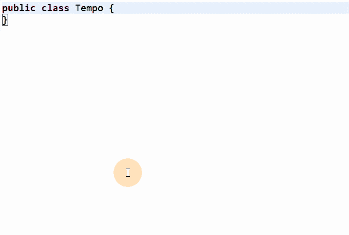
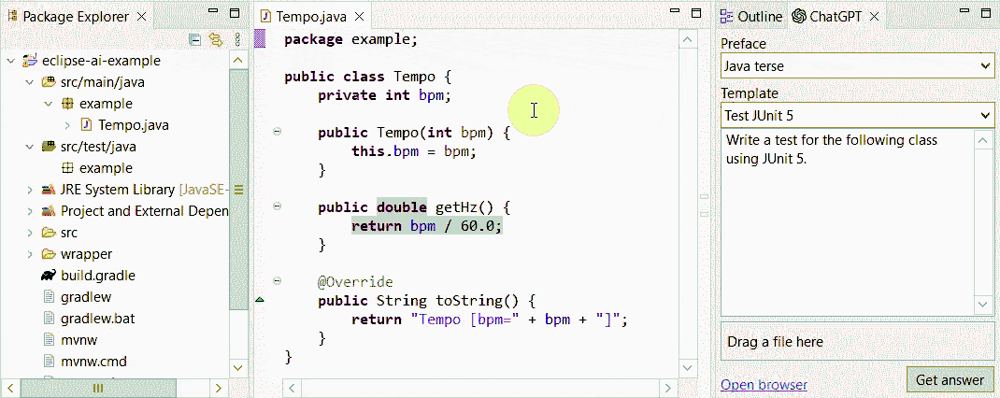
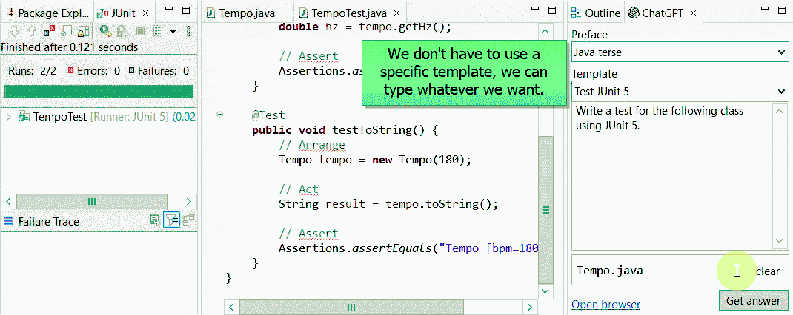

# AI coding tools for Eclipse developers

There has been a lot of hype surrounding AI coding tools. So far there are two main categories of tool:

- Autocomplete tools, where GitHub Copilot is the best known brand.
- Chat tools where you copy-paste your existing code into a text box, ask the AI to do things to it (refactor, explain, add tests, etc.) and then copy the answers out. You can do this in a web browser, or there are IDE plugins to make the process easier and more powerful.

All of these categories of AI tooling are available to Eclipse users. As a quickstart, if you just clone this repo and then run `./gradlew equoIde` or `./mvnw equo-ide:launch` (depending on your preference), then you'll get an example project setup with all of the plugins that we are talking about, as well as some code to tinker with.

## Copilot

GitHub Copilot is not available for Eclipse right now, but [Tabnine](https://www.tabnine.com/) provides exactly the same concept. Compared to Copilot, Tabnine has the bonuses of a free tier and the option to self-host.

You can install Tabnine from the [Eclipse marketplace](https://marketplace.eclipse.org/content/tabnine-ai-assistant-software-developers), but in this demo we are using [EquoIDE](https://github.com/equodev/equo-ide#quickstart) to handle installation.

If it's not working for you, make sure to click the **Tabnine Starter** in the bottom right and login to your Tabnine account.

There is another 

## ChatGPT (inside the IDE)

When it comes to chat-based tools, the trick is to say "this is the code I have, this what I want you to do with it". It's shocking how effective it is.

You can also ask ChatGPT to write code from scratch. The combination of its domain knowledge plus coding ability is surprisingly effective.

### GPT-4

The demos above are all using GPT-3.5 which is free. GPT-4 is much more powerful, but API access is currently gated behind a long waitlist. Luckily, if you subscribe to [ChatGPT Plus](https://chat.openai.com/) for $20 per month, you get GPT-4 access within the web interface right away. The demos above use the web interface, so you can use GPT-4 for coding tasks without a waitlist.

### Prompt engineering

If you do some googling around "Prompt engineering", you'll see suggestions to start every chat session with "You are an expert Java programmer" to put the LLM into the "right mood" for best generating your code. You can also say "respond only with code, do not provide commentary" if you prefer shorter answers.

The [Equo ChatGPT plugin](https://github.com/equodev/equo-ide-chatgpt) (which was inspired by the [AssistAI](https://github.com/gradusnikov/eclipse-chatgpt-plugin) plugin). It lets you use your ChatGPT account (free or Plus) to ask questions without all the boilerplate.

TODO