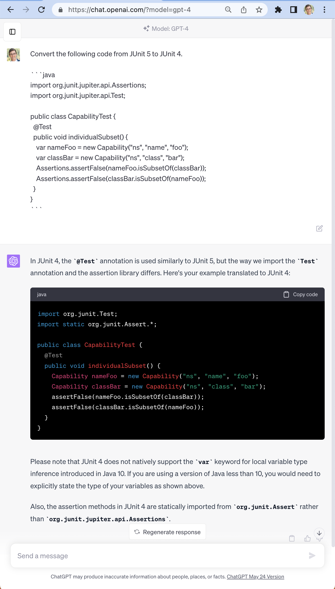
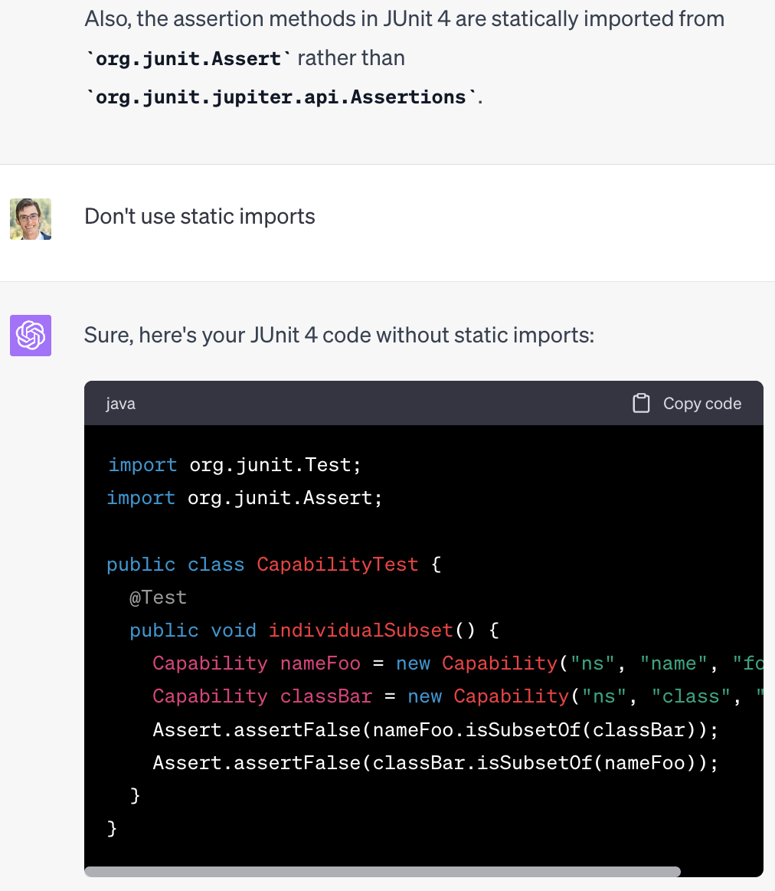

# AI coding tools for Eclipse developers

There has been a lot of ~~hot air~~ hype surrounding AI coding tools. So far there are two main categories of tool:

- autocomplete tools, where GitHub Copilot is the best known brand
- chat tools where you copy-paste your existing code into a text box, ask the AI to do things to it (refactor, explain, add tests, etc.) and then copy the answers out.

Both of these categories are available to Eclipse users. In this repo we will show how to get them and how to use them. As a quickstart, if you just clone this repo and then run `./gradlew equoIde` or `./mvnw equo-ide:launch` (depending on your preference), then you'll get an example project setup with all of the plugins that we are talking about, as well as some code to tinker with.

## Copilot

GitHub Copilot is not available for Eclipse right now, but [Tabnine](https://www.tabnine.com/) provides exactly the same concept, with the bonus that it is possible to self-host Tabnine.

TODO: screenshot

You can install Tabnine from the [Eclipse marketplace](https://marketplace.eclipse.org/content/tabnine-ai-assistant-software-developers), but in this demo we are using [EquoIDE](https://github.com/equodev/equo-ide#quickstart) to handle installation.

If it's not working for you, make sure to click the (TODO icon) in the bottom right and login to your Tabnine account.

## ChatGPT

When it comes to chat-based tools, GPT4 is currently far more useful than the other LLMs on the market. Especially as a beginner, GPT4 gives fantastic results, whereas other models require more "prompt engineering" to get a useful result. For now, API access to GPT4 is behind a long waitlist, but you can use GPT4 through a [web interface](https://chat.openai.com/) right now as a ChatGPT Plus subscriber. I highly recommend starting with GPT4 at least for one month so that you can see what is possible.

For example, let's ask ChatGPT4 to convert this unit test from JUnit 5 to JUnit 4.

```java
import org.junit.jupiter.api.Assertions;
import org.junit.jupiter.api.Test;

public class CapabilityTest {
  @Test
  public void individualSubset() {
    var nameFoo = new Capability("ns", "name", "foo");
    var classBar = new Capability("ns", "class", "bar");
    Assertions.assertFalse(nameFoo.isSubsetOf(classBar));
    Assertions.assertFalse(classBar.isSubsetOf(nameFoo));
  }
}
```

To ask this question, the key things to remember are:

- `shift+enter` inserts a newline without submitting the prompt
- You should put code behind a ` ```java ` fence

Here's what that looks like.



If you ask that same question using GPT 3.5 instead of 4 (try it yourself!), you get almost the same answer, except:

- you don't get static imports
- it doesn't explain why it replaces `var` with the full explicit type `Capability`

In this case it's not a huge difference, but it demonstrates how GPT4 can do a much better job explaining itself. If you don't like the static assertions, just tell that to ChatGPT.



### Things to ask

- Explain this code
- Generate unit tests for this code
- Refactor this code
- Write a class for me that does X

### Prompt engineering

Looking at the screenshots above, you can see a few awkward things about this workflow. The most obvious is that you have to manually copy-paste a lot of text, and that text consumes a lot of screen space.

The second thing is that you're going to be asking it the same question over and over again "Write unit tests for this code using JUnit 5", etc. If you do some googling around "Prompt engineering", you'll see suggestions to start every chat session with "You are an expert Java programmer" to put the LLM into the "right mood" for best generating your code.

To make this easier, there is the [Equo ChatGPT plugin](https://github.com/equodev/equo-ide-chatgpt) (which was inspired by the [AssistAI](https://github.com/gradusnikov/eclipse-chatgpt-plugin) plugin).

TODO